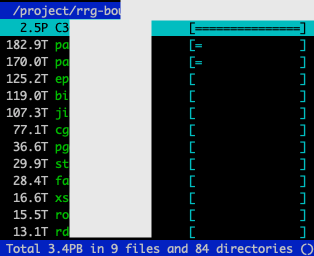
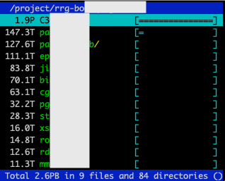
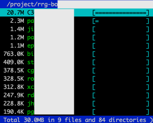
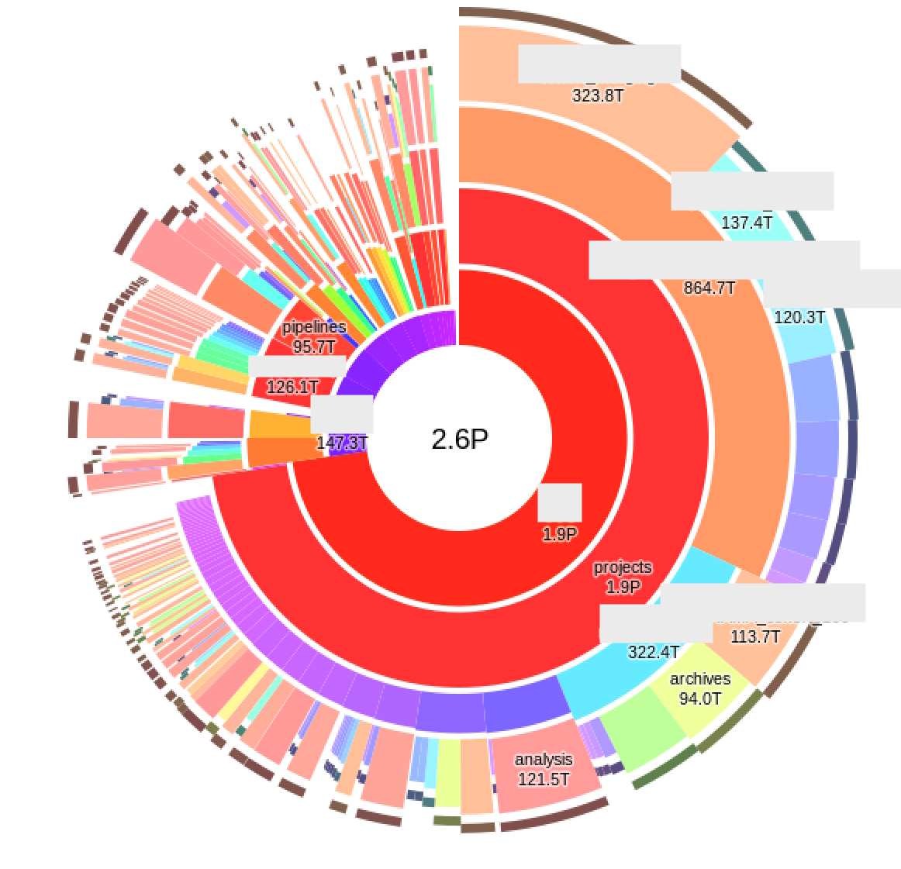

# robinhood2duc
This tool is intended to create databases compatible with [duc](http://duc.zevv.nl/) with the content of the MySQL database of the [Robinhood Policy Engine](https://github.com/cea-hpc/robinhood)

This tool can scan a directory (and its sub-directories) with 18M inodes in 1h with a single core. Using gnu-parallel, the entire filesystem with 446M inodes can be scanned multiple time per day by only using the content of the database (no I/O on the filesystem).

## User view
Once the databases are created by the system, the users can access the information within them with a simple `duc` command. This command can be wrapped into a a simple bash script to hide the path to the database.

### Apparent size
This is the size shown if a user would read all the bytes in the files. This include the holes in sparse file and does not include space saved by ZFS compression.



### Actual size
This size takes into consideration sparse file and compression. This is the size reported by the quota command.



### File count
This show the number of inodes used in this tree.



### X GUI
The X gui can also report the previous information, but show this information at multiple depth level in the same view.



## Installation
Robinhood need to be installed and configured. Robinhood configuration file need to be available on the server where this tool run, but this tool does not require Robinhood itself. Its parsing the config file to read the same MySQL database. A special user with read-only permission on the ENTRIES and NAMES table can be used.

Lustre need to be mounted but few I/O are done, this is mostly to gather the filesystem device number that `duc` is using to support multiple filesystem in the same database.

This python code use the binary mysql client, so these following packages need to be installed before running `pip install`.

* mysql-devel
* gcc

Using a python virtualenv is recommended:

```
virtualenv-3.6 env
source env/bin/activate
pip install -r requirements.txt
```

`lustreapi.py` is currently not available in pip, it will need to be downloaded manually:

```
wget https://raw.githubusercontent.com/guilbaults/python-lustreapi/master/lustreapi.py
```
### duc
`duc` need to be compiled with `--with-db-backend=sqlite3` instead of the default backend. Further instructions are available in the [INSTALL file](https://github.com/zevv/duc/blob/master/INSTALL)

## Usage
The sqlite database need to be generated with the `crawl.py` script.

```
crawl.py --help
usage: crawl.py [-h] config path db_path

This tool is used to create a `duc` compatible database. The content is
generated from the MySQL database managed by Robinhood.

positional arguments:
  config      Robinhood config path
  path        Path where to start the crawl
  db_path     Path to the output sqlite database file

optional arguments:
  -h, --help  show this help message and exit
```

### Example
To generate one database:

```
python crawl.py /etc/robinhood.d/lustre02.conf /lustre02/home/sigui4/ /tmp/sigui4.sqlite
```

To read it with `duc`:

```
duc ui --database=/tmp/sigui4.sqlite /lustre02/home/sigui4/
```

This will launch the ncurse interface
## Contributing
Pull requests are welcome. For major changes, please open an issue first to discuss what you would like to change.

Please make sure to update tests as appropriate.

## License
[Apache License 2.0](https://choosealicense.com/licenses/apache-2.0/)
